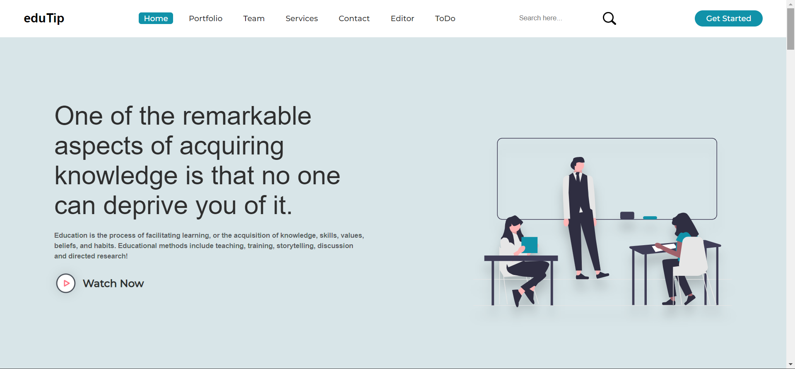

# PBL-eduTip
Second Year PBL Project 

Our Educational Website would provide all the education related stuffs:  
Notes, Sample Papers, Online Video Lectures and courses to crack competitive  
exams like JEE-Main, JEE-Advanced, GATE, etc. Students can clear their doubts  
by sending their questions to our website. We have added Quizzes for Students  
who are willing to solve problems on different topics. We have also added  
Interview questions for students who are preparing for placements.  
  
✔ We have made this website as responsive website so, students or users can  
   easily access our website from  any device.
✔ Added signup and login authentication using google firebase for added security and to maintain privacy.    
✔ Provided a frontend code editor so that students don't have to access other website for the same.
✔ Implemented a to-do list to keep track of the task that are to be accomplished on a particular day.     
✔ Quiz Section is an interesting feature for students which provide them with  
   lots of questions. They can view their scores easily and solutions of every questions.  
✔ Projects – in this we have added a project section where students from schools and colleges can get projects for final year.  
   
It is completely responsive website, to provide smooth experience...